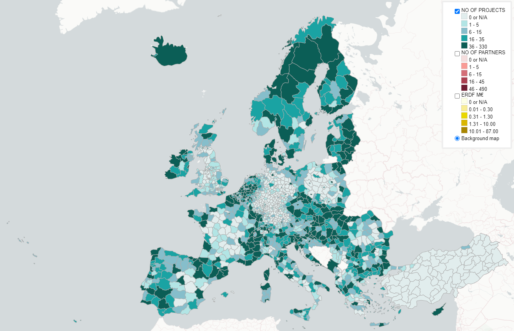

### Interreg, IPA CBC and ENI CBC cooperation data in 2014-2020 by NUTS3 regions ###

Data source: *[keep.eu](https://keep.eu) (Regions with 0 values can mean that data is not available.)*  

Select layer in the top right menu \| Hover with mouse on the map to see region data \| Zoom in to see numbers on regions  

